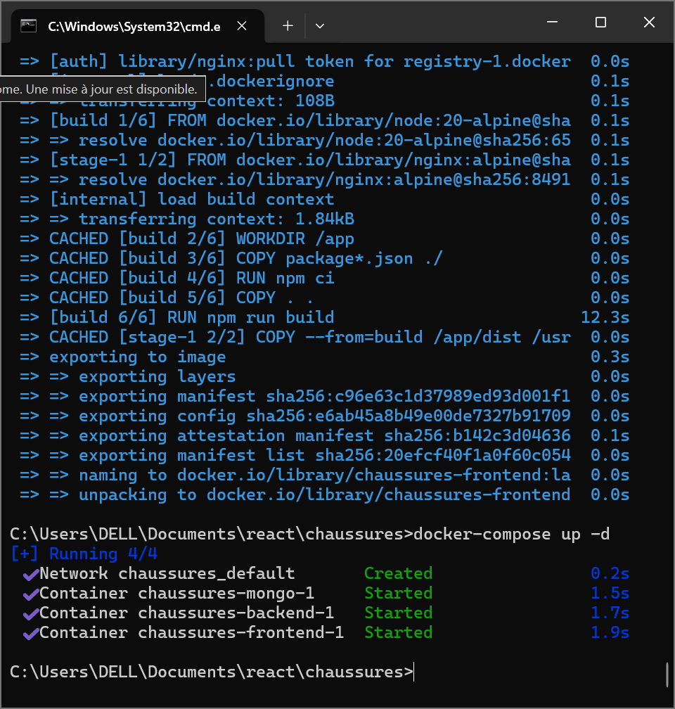
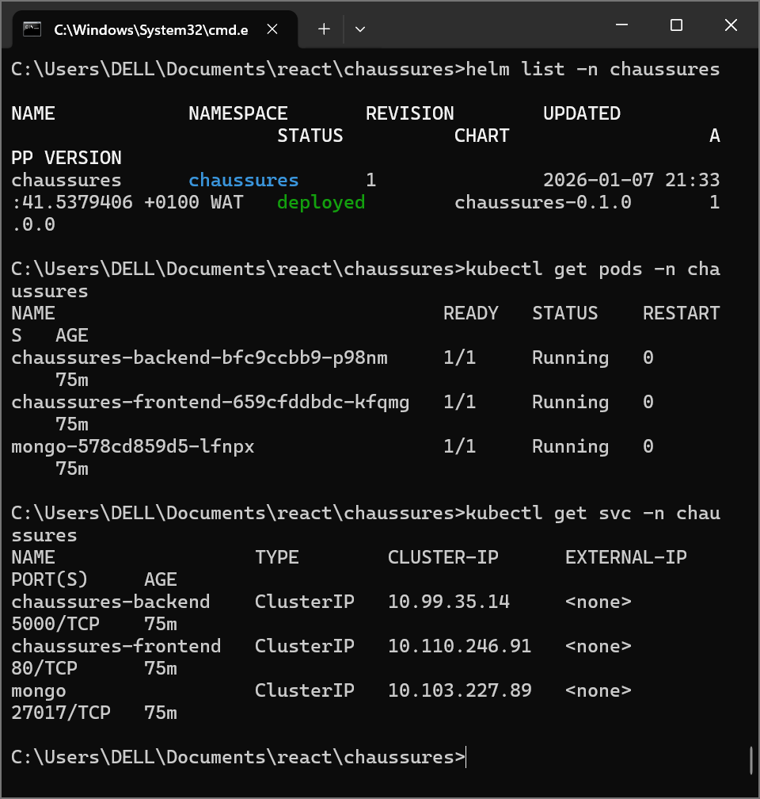
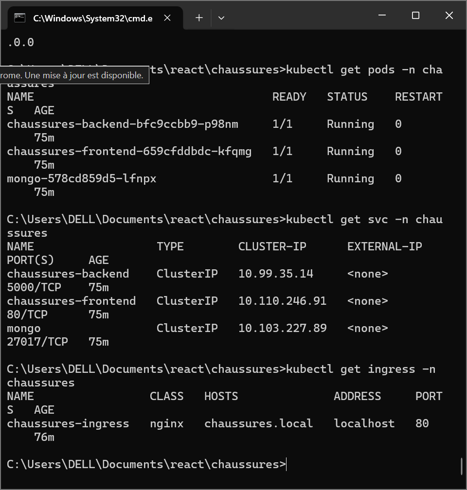
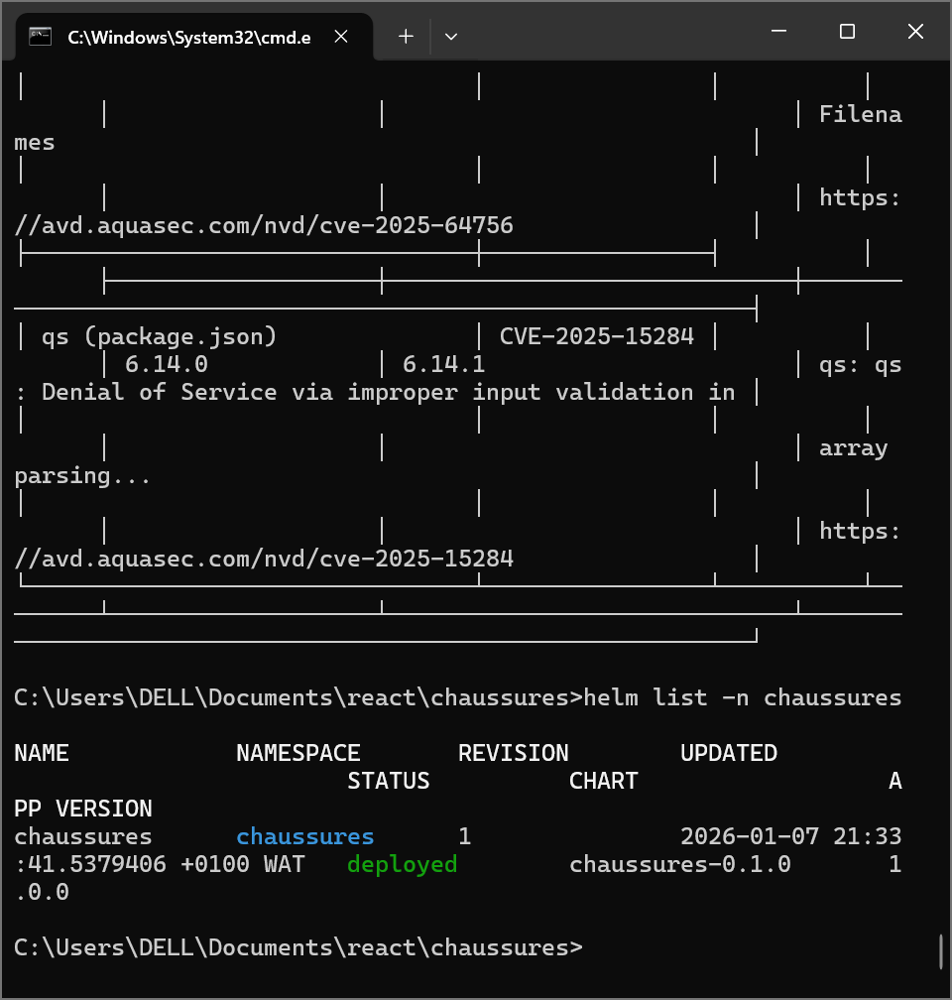
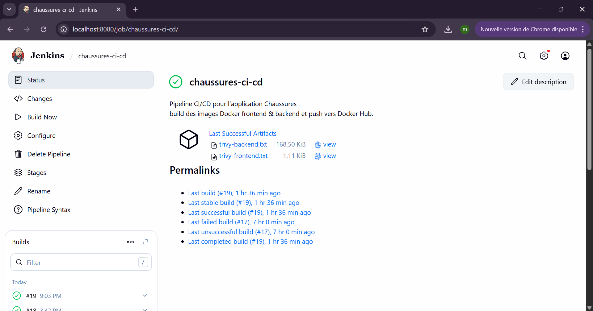
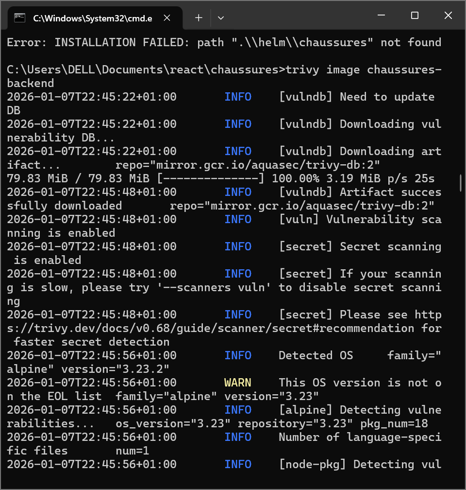
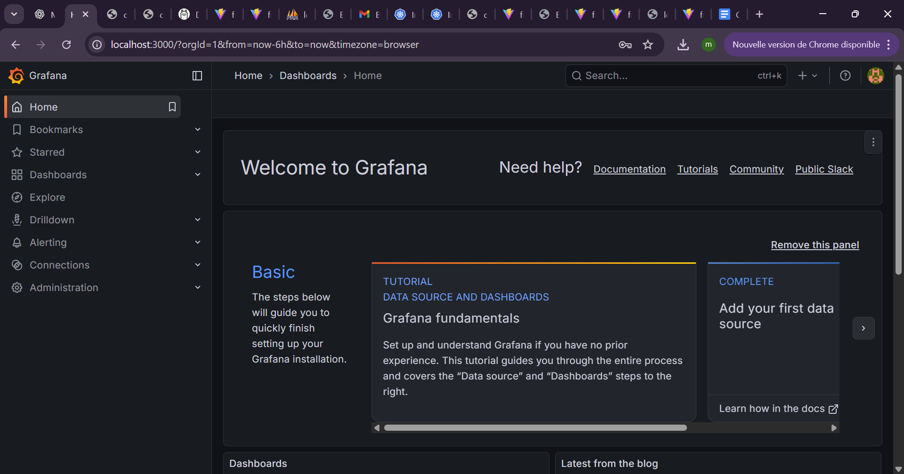

# 🥿 Chaussures Platform – DevOps & Kubernetes Project

## 📌 Présentation
Chaussures Platform est une application **full-stack** développée dans le cadre du **mini-projet DevOps 2025–2026**.
Elle est entièrement **conteneurisée**, **automatisée avec CI/CD**, et **déployée sur Kubernetes (Docker Desktop)**.

---

## 🏗️ Architecture
Frontend **React** → Backend **Node.js (API REST)** → **MongoDB**
---

## 🧰 Stack Technique
- **Frontend** : React + Nginx
- **Backend** : Node.js + Express
- **Base de données** : MongoDB
- **CI/CD** : Jenkins
- **Sécurité** : Trivy
- **Orchestration** : Kubernetes (Docker Desktop)
- **Packaging** : Docker & Docker Compose
- **Déploiement** : Helm Charts
- **Monitoring** : Prometheus & Grafana

---

## 🐳 Docker & Docker Compose
- Dockerfile backend
- Dockerfile frontend
- docker-compose.yml pour exécution locale



---

## ☸️ Kubernetes (Docker Desktop)
Ressources Kubernetes :
- Namespace dédié
- Deployments (backend, frontend, mongo)
- Services (ClusterIP)
- Ingress NGINX

```bash
kubectl get pods -n chaussures
```



---

## 🚪 Ingress NGINX
Accès via :
```
http://chaussures.local
```



---

## 📦 Helm Charts
Helm Chart personnalisé pour le déploiement complet :

```bash
helm install chaussures ./helm/chaussures -n chaussures --create-namespace
```



---

## 🔁 CI/CD avec Jenkins
Pipeline automatisé :
1. Build images Docker
2. Scan de sécurité avec Trivy
3. Push vers Docker Hub
4. Déploiement local



---

## 🔐 Sécurité – Trivy
Analyse des vulnérabilités :
- Images backend & frontend
- Sévérités HIGH & CRITICAL
- Génération de rapports



---

## 📊 Monitoring – Prometheus & Grafana
- Collecte métriques cluster & application
- Dashboards Grafana
- Observabilité complète



---

## 📁 Arborescence du Projet
```
chaussures/
├── backend/
├── frontend/
├── docker-compose.yml
├── Jenkinsfile
├── k8s/
├── helm/
│   └── chaussures/
├── screenshots/
│   ├── docker-desktop.png
│   ├── grafana-dashboard.png
│   ├── helm-install.png
│   ├── ingress-browser.png
│   ├── kubectl-pods.png
│   ├── pipeline-jenkins.png
│   └── trivy-scan.png
└── README.md
```

---

## 👤 Auteur
**Mansour Hassine**  
4ᵉ année Génie Logiciel  
Année universitaire **2025–2026**

---

## ✅ Conformité au Cahier des Charges
✔ Application fonctionnelle  
✔ Docker & Docker Compose  
✔ CI/CD Jenkins  
✔ Scan Trivy  
✔ Push Docker Hub  
✔ Kubernetes Docker Desktop  
✔ Helm Charts  
✔ Prometheus & Grafana  

---

✨ Projet DevOps complet et opérationnel
